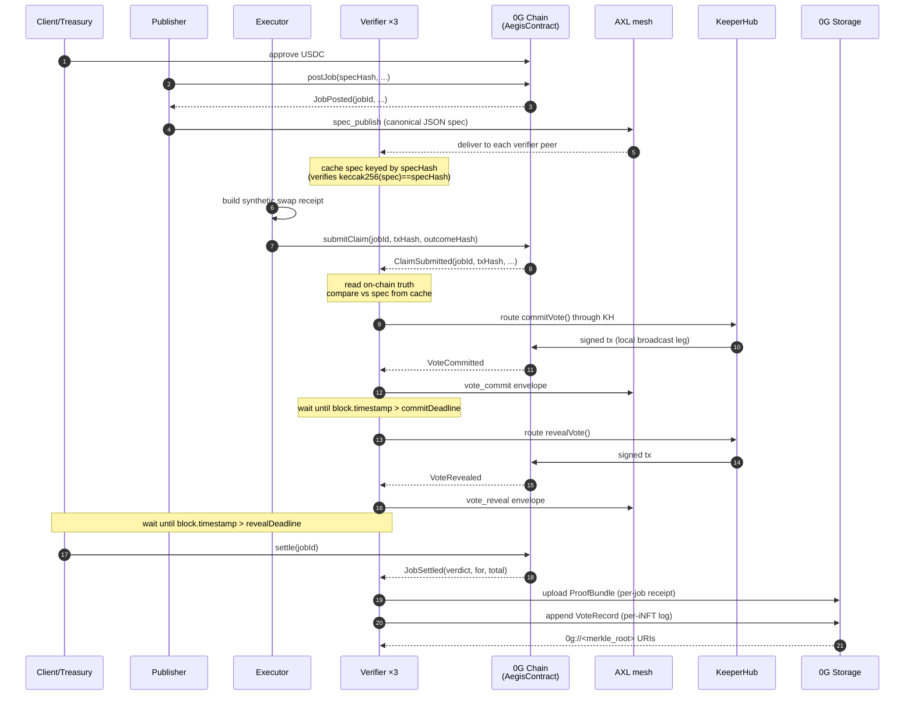
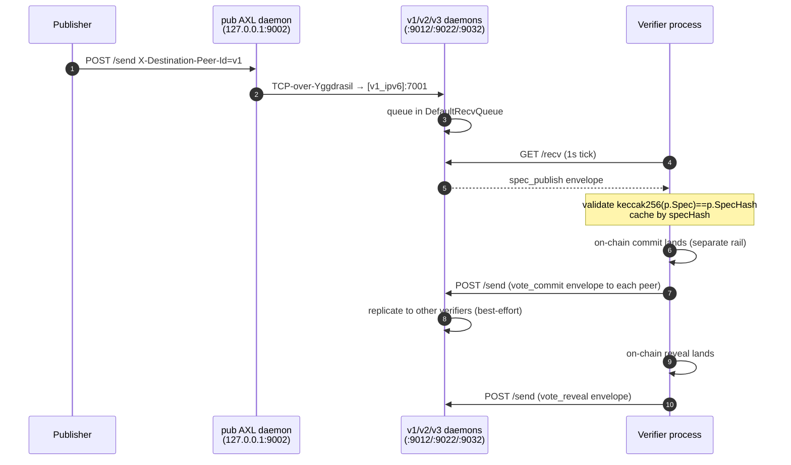
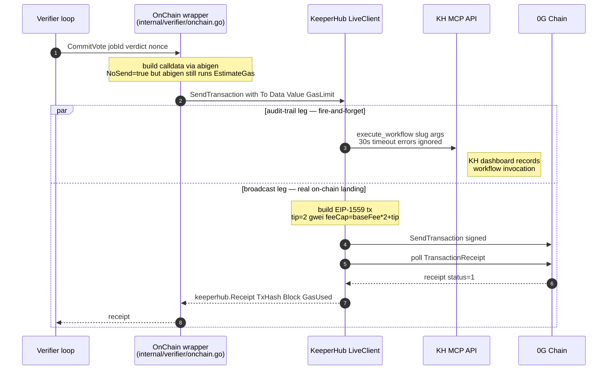
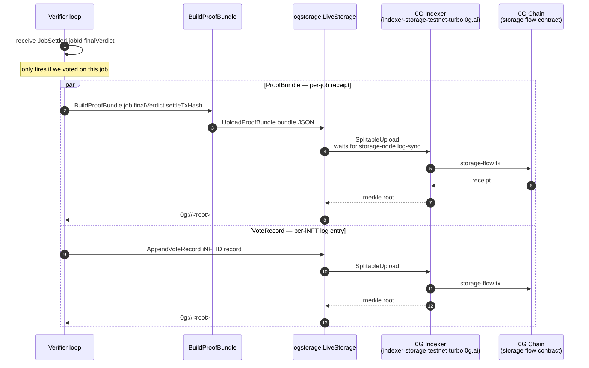

# Aegis

**Aegis** is a peer-to-peer swarm of independent verifier agents that
checks whether on-chain agent executions actually matched their spec.

When one agent claims to have done a paid job for another, the swarm
re-checks the chain, votes commit-reveal, and settles escrow under a
BFT-style 2-of-3 majority rule (tolerates one dishonest or offline
verifier per job). Dishonest verifiers are slashed; accurate ones earn
fees and build reputation as ERC-7857 iNFTs on 0G.

## Why it's needed

| Layer                                   | Today                   |
| --------------------------------------- | ----------------------- |
| Agent identity                          | Solved (ERC-8004)       |
| Agent payments                          | Solved (x402)           |
| Agent reputation                        | Partial — self-attested |
| **Did the agent actually do the work?** | **No standard.**        |

x402 pays on HTTP 200, not on a correct result. Without a check, _"I
did your trade"_ and _"I actually did your trade correctly"_ look the
same. Aegis is the check.

## How it's built

Four pieces, each doing one job:

| Piece          | What it does                                                      |
| -------------- | ----------------------------------------------------------------- |
| **0G Chain**   | The contract. Holds money, records votes, settles.                |
| **AXL**        | Off-chain mesh. Carries the job spec from publisher to verifiers. |
| **KeeperHub**  | Audit trail. Every settlement tx shows up in a dashboard.         |
| **0G Storage** | Long-term receipts — one per job, plus a per-verifier history.    |

## Who pays what

| Role                                  | Puts up                                                | Gets back                                                                      |
| ------------------------------------- | ------------------------------------------------------ | ------------------------------------------------------------------------------ |
| **Client** (job poster)               | ~10,050 USDC (refundable except for ~50 USDC in fees)  | The work, or a refund + half the executor's slashed stake.                     |
| **Executor / Solver**                 | Their own ~10,000 USDC working capital + 500 USDC bond | A ~30 USDC fee on success. On a FAIL: working capital gone + 25% bond slashed. |
| **Verifier ×3**                       | 100 USDC stake                                         | Share of bounty if in the majority. 10% stake slashed if in the minority.      |

The **executor is a solver** in the UniswapX / CowSwap / 1inch Fusion
sense — a bonded liquidity provider that reads job specs off-chain (over
AXL), brings their own working capital to perform the on-chain action,
and earns a fee on success. Picking a solver per job is currently
first-come-first-served against an explicitly-named executor address;
[future work](#future-work) replaces this with an auction.

Verifiers and executors share the same `VerifierRegistry` — both are
bonded participants, just at different stake levels.

Full economic model: [docs/architecture.md](docs/architecture.md).

## Deployments

### 0G Galileo testnet (chain id 16602)

| Contract         | Address                                      |
| ---------------- | -------------------------------------------- |
| MockUSDC         | `0xe9dA98EB0AF68cC48be7F71C29A7Bc5bA7fB45Eb` |
| VerifierINFT     | `0xA1A6327a64502A66565A6a11f6754Cd9B867D018` |
| VerifierRegistry | `0x50ce23AE35bbe43fFAd0B36FD3F567560b8EfB18` |
| AegisContract    | `0xa89833fBD1844763cc77C0a3aFaE32697A2F990f` |
| Treasury         | `0x7C9DcA2fB05cFc732794CEe846888f3B1D7FE06a` |
| Owner / Deployer | `0x7C9DcA2fB05cFc732794CEe846888f3B1D7FE06a` |

**Note:** Treasury is currently a personal wallet address.

## Setup

### Prerequisites

- **Go 1.26+**.
- **Foundry**.
- **openssl**.
- **python3**.

```bash
bash scripts/setup-axl.sh           # clones gensyn-ai/axl, builds .axl/bin/node, generates AXL keys
forge install                       # contract dependencies
```

Verifier wallets need to be registered in `VerifierRegistry` once per
deployment (each stakes 100 mUSDC). Idempotent — re-run safely:

```bash
V1_PK=0x... V2_PK=0x... V3_PK=0x... \
  bash scripts/register-verifiers.sh
```

The script tolerates 0G Galileo's null-response RPC and verifies stake on chain
afterward. See [scripts/register-verifiers.sh](scripts/register-verifiers.sh).

### Per-run env vars

The e2e demo expects all of these set:

```bash
export TREASURY_PK=0x...
export V1_PK=0x... V2_PK=0x... V3_PK=0x...    # must match registered verifier wallets
export EXECUTOR_PK=0x...                       # any funded EOA
export ORG1_API_KEY=... ORG2_API_KEY=... ORG3_API_KEY=...  # one KeeperHub org per verifier
```

KeeperHub workflow slugs per org are persisted in [configs/keeperhub.toml](configs/keeperhub.toml).
If you swap orgs, regenerate them with [scripts/list-keeperhub-workflows.sh](scripts/list-keeperhub-workflows.sh).

## Run the end-to-end demo

```bash
bash scripts/e2e-demo.sh
```

Expected wall-clock: ~2-3 minutes (commit window is short on 0G Galileo because blocks are ~2s).

## End-to-end flow

### Big picture: one job lifecycle



### AXL: the off-chain agent transport

AXL is the only off-chain message rail. It carries **two** envelope types
that matter to consensus, plus vote replicas for auditability.



**What flows over AXL today:**

| Envelope       | Direction               | Load-bearing?                                                   | Code                                                                                                                               |
| -------------- | ----------------------- | --------------------------------------------------------------- | ---------------------------------------------------------------------------------------------------------------------------------- |
| `spec_publish` | publisher → 3 verifiers | **Yes** — verifier abstains if cache miss                       | [cmd/publisher/main.go:130](cmd/publisher/main.go#L130), [internal/verifier/axl_bridge.go:74](internal/verifier/axl_bridge.go#L74) |
| `vote_commit`  | verifier → all peers    | No — chain is authoritative; this is for the demo UI / auditors | [internal/verifier/axl_bridge.go:60](internal/verifier/axl_bridge.go#L60)                                                          |
| `vote_reveal`  | verifier → all peers    | No — same as above                                              | same                                                                                                                               |

The publisher never appears on chain after `postJob`; everything else
flows through AXL. The verifier's spec lookup ([internal/verifier/loop.go:awaitSpec](internal/verifier/loop.go)) polls the cache for up to 10s, then aborts the verification with `not in AXL cache`.

### KeeperHub: settlement-tx audit rail

Every `commitVote` / `revealVote` / `settle` the verifier signs goes
through `keeper.SendTransaction`. KeeperHub fires a `execute_workflow`
async **for the audit trail** while the verifier signs and broadcasts
locally. The two legs are decoupled so the on-chain tx still lands
when KeeperHub's transactional path is unhealthy on 0G Galileo (see
[internal/keeperhub/live.go:35-54](internal/keeperhub/live.go#L35-L54) for the bug story).



**What flows through KeeperHub:**

| Purpose  | Frequency per job            | Why route through KH |
| -------- | ---------------------------- | -------------------- |
| `commit` | 1 per verifier (3 total)     | Audit trail          |
| `reveal` | 1 per verifier (3 total)     | same                 |
| `settle` | 0–1 (whoever calls it first) | same                 |

Each verifier uses its own KH org (3 orgs total). Workflow slugs per
purpose live in [configs/keeperhub.toml](configs/keeperhub.toml) under
`[verifier_1]`, `[verifier_2]`, `[verifier_3]`. The `KEEPERHUB_VERIFIER_INDEX` env var picks which section a given verifier reads.

#### What KeeperHub actually does today (be honest)

The architecture imagined KH as a **settlement-tx rail**: retry on
transient failures, gas optimization, MEV protection, and audit. In
this build KH delivers **only the audit slot** — every other promised
value is blocked on upstream bugs.

| Promised                                        | Delivered today                                                                              |
| ----------------------------------------------- | -------------------------------------------------------------------------------------------- |
| Reliable broadcast                              | No — `web3/write-contract` action can't submit on 0G Galileo (gas tip cap bug, see #1 below) |
| Calldata emission via `call_workflow`           | No — returned `"No write action node found"` (#2)                                            |
| Gas overrides via `_protocolMeta`               | No — silently ignored (#3)                                                                   |
| Polling state via `get_direct_execution_status` | No — returns 405 on every call                                                               |
| **Third-party audit dashboard**                 | Fixed — workflow invocations DO show up, even when the workflows themselves error            |

The dual-leg pattern in [internal/keeperhub/live.go](internal/keeperhub/live.go)
exists exactly because of this: we fire `execute_workflow` async into
KH so the invocation lands on KH's dashboard, **and** in parallel we
sign + broadcast the tx locally with the verifier's own key at 2 gwei
tip. The on-chain tx lands via the local leg; the KH dashboard row
exists for audit even when its own broadcast attempt errors.

If you sign in to a verifier's KH org dashboard during a demo run,
expect to see workflow invocations marked with errors like
`Invalid function arguments: jobId: uint256 is missing` or
`Failed to acquire nonce lock for 0x…:16602`. That's the upstream
bug catalogue below; the actual on-chain commit/reveal/settle txs
landed regardless.

#### KeeperHub bugs we hit + reported

All three were reported to the KeeperHub team (**Joel** and **Luca**)
with full reproduction details + raw MCP request/response samples;
they confirmed each as a known issue and committed to fixes. We share
the reproducers here so anyone re-running this codebase against KH
can verify whether each is still open.

| #   | Symptom                                                                                                                                                                                                                                                                                                              | Reproducer                                                                                                                                                                                                                                                                                                                                                                                                                                                                                                                                                                          | Status                                                                                    |
| --- | -------------------------------------------------------------------------------------------------------------------------------------------------------------------------------------------------------------------------------------------------------------------------------------------------------------------- | ----------------------------------------------------------------------------------------------------------------------------------------------------------------------------------------------------------------------------------------------------------------------------------------------------------------------------------------------------------------------------------------------------------------------------------------------------------------------------------------------------------------------------------------------------------------------------------- | ----------------------------------------------------------------------------------------- |
| 1   | `web3/write-contract` action submits at `maxPriorityFeePerGas=1.5 gwei`; 0G Galileo's mempool rejects with `gas tip cap below minimum (needed 2 gwei)`. No per-org / per-chain gas knob exists.                                                                                                                      | List a `web3/write-contract` workflow targeting any 0G Galileo (chain 16602) contract method. Trigger via `execute_workflow`. Watch the resulting tx — it never lands; KH dashboard shows the broadcast attempt as failed. Tried `gasLimitMultiplier` (limit-only, not tip cap), looking for a `set_chain_gas` MCP tool, and `_protocolMeta` (see #3).                                                                                                                                                                                                                              | Reported to Joel + Luca. Allegedly fixed; UNVERIFIED against this codebase.               |
| 2   | `call_workflow(slug, inputs)` rejects every `web3/write-contract` workflow with `"No write action node found in workflow"`. `search_workflows({workflowType:"write"})` returns zero across the whole marketplace, suggesting no listed workflow counts as a write.                                                   | Create a workflow with action `web3/write-contract`, list it (give it a `listedSlug`), then call `call_workflow(slug, {jobId:"1", commitHash:"0x..."})`. Response: `"No write action node found in workflow"`. Also tried seven template syntaxes for the function-arg interpolation: `{{inputs.jobId}}`, `{{$.inputs.jobId}}`, `{{$inputs.jobId}}`, `{{inputs[0]}}`, `{{trigger.input.jobId}}`, `{{@manual-trigger:Manual Trigger.input.jobId}}`, and the bare `inputs.jobId` — every one fails with `Cannot convert <template> to a BigInt` or `Unresolvable template reference`. | Reported to Joel + Luca with the full template-syntax probe. Allegedly fixed; UNVERIFIED. |
| 3   | `execute_contract_call` with `_protocolMeta:{maxPriorityFeePerGas:"2000000000"}` returns `status:"failed"` and never broadcasts. Verified by polling `eth_getTransactionCount` on the wallet — never changes. `get_direct_execution_status` returns 405 on every call so the failure reason isn't readable from MCP. | `execute_contract_call({contractAddress:"0xa89833fB...", method:"commitVote", args:["1","0x..."], _protocolMeta:{maxPriorityFeePerGas:"2000000000"}})`. Then `cast nonce <wallet> --rpc-url https://evmrpc-testnet.0g.ai` — unchanged. Then `get_direct_execution_status({executionId:"<id>"})` → HTTP 405.                                                                                                                                                                                                                                                                         | Reported to Joel + Luca. Allegedly fixed; UNVERIFIED.                                     |

**Verification owed.** A scheduled agent was meant to re-probe these
against the live MCP and either collapse the dual-leg or confirm the
bugs are still open — see the conversation log; it was deferred. The
collapse target is documented in [internal/keeperhub/live.go:62-66](internal/keeperhub/live.go#L62-L66):
drop the `execute_workflow` audit leg, switch to a single
`call_workflow → sign locally → broadcast` cycle.

### 0G Storage: post-settlement receipts

When `JobSettled` fires, each verifier writes two records to 0G Storage.
Both are JSON, content-addressed by merkle root, addressed as
`0g://<root>`. Each upload also submits an EVM tx to the 0G Storage
flow contract (`0x22E0...5296`).



**What flows to 0G Storage:**

| Object        | Cardinality                                    | Purpose                                                                                                                                                  | Code                                                                   |
| ------------- | ---------------------------------------------- | -------------------------------------------------------------------------------------------------------------------------------------------------------- | ---------------------------------------------------------------------- |
| `ProofBundle` | 1 per (verifier, job) — 3 per job              | Long-form receipt: spec, claim, votes, settlement, attached KH audit refs. Auditors can replay the verification.                                         | [internal/verifier/proof_bundle.go](internal/verifier/proof_bundle.go) |
| `VoteRecord`  | 1 per (verifier, job) appended to per-iNFT log | Per-verifier append-only history of (jobId, votedVerdict, finalVerdict, wasCorrect). New auditors can fetch a verifier's full track record from one URI. | [internal/ogstorage/og_service.go](internal/ogstorage/og_service.go)   |

The on-chain tx that the storage SDK submits to the flow contract is a
real EVM tx — visible on chainscan-galileo. The `0g://<root>` URI itself
is a content address into 0G's storage layer; you need a 0G Storage
gateway (or the SDK's download method) to read the actual bytes.

### What each rail guarantees

| Rail           | Guarantee                                                                                                   |
| -------------- | ----------------------------------------------------------------------------------------------------------- |
| **0G Chain**   | Commits stay hidden until reveal. PASS wins when at least 2 of 3 verifiers say PASS. Slashing is final.     |
| **AXL**        | Spec gets to all 3 verifiers off-chain. Chain holds the hash, so verifiers can detect a tampered spec.      |
| **KeeperHub**  | Each settlement tx shows up in a dashboard you don't control — third-party audit log.                       |
| **0G Storage** | One receipt per job, one history log per verifier. Anyone can replay a verifier's full record from one URI. |

### What we assume

- Block finality on 0G Chain.
- Standard crypto (keccak256, ECDSA).
- Out of any 3 verifiers, at least 2 are honest.
- The executor eventually claims or times out — `cancelStaleJob` recovers stuck jobs.

### What we don't trust

- Any single verifier — that's the point.
- The executor's word — verifiers re-check against chain truth ([check_uniswap_swap.go:147-161](internal/verifier/check_uniswap_swap.go#L147-L161)).
- The client — an impossible spec just makes all verifiers vote FAIL.

### Contract rules

[contracts/src/AegisContract.sol](contracts/src/AegisContract.sol) enforces:

- A job settles once, and only once.
- Each verifier commits once, reveals once.
- A reveal must hash to its commit.
- PASS wins when `passReveals × 3 ≥ totalReveals × 2`.
- Slashing can't go below zero.
- Settle is reentrancy-guarded.

### What's in / out

**In:** 3+ verifiers, Uniswap V3 single-hop swaps, commit-reveal with 2-of-3 majority, ERC-7857 iNFTs, KeeperHub for settlement txs.

**Out:** multi-hop swaps, other DEXes, quadratic stake weighting, slashing for non-reveal, ZK proofs, cross-chain beyond Base + 0G.

## Troubleshooting

| Symptom                                                                          | Cause                                                                                                  | Fix                                                                                                                                                              |
| -------------------------------------------------------------------------------- | ------------------------------------------------------------------------------------------------------ | ---------------------------------------------------------------------------------------------------------------------------------------------------------------- |
| `verify N abstaining: spec ... not in AXL cache (publisher silent or AXL down)`  | Publisher's AXL fan-out failed, or zombie verifier from prior run consumed the `/recv` queue first     | Check `publisher.log` for 502 errors; the e2e script kills zombies on startup, but if you spawn verifiers manually, kill old ones with `pkill -f 'exe/verifier'` |
| `502 Bad Gateway: connect tcp [...]:NNNN: connection was refused` on AXL `/send` | Daemons running with mismatched `tcp_port` — sender dials its OWN `tcp_port`, must equal destination's | All daemons use `tcp_port=7001`; force-restart the swarm (`run-axl-swarm.sh` always restarts on re-run)                                                          |
| `commit N: build commit calldata: execution reverted`                            | Verifier wallet not registered in `VerifierRegistry` (or stake = 0)                                    | Run [scripts/register-verifiers.sh](scripts/register-verifiers.sh)                                                                                               |
| `(settle tx hash not captured)` and status stays `ClaimSubmitted`                | Settle was called before `revealDeadline`, reverted with `DeadlineNotPassed`                           | The e2e script now waits for the deadline before calling settle                                                                                                  |
| `swap (synth.)` link 404s on chainscan                                           | The "swap" tx is a synthetic hash the executor invents locally — no real swap broadcasts               | Working as intended; the e2e output no longer prints this link                                                                                                   |
| `(no proofbundle root found in log)`                                             | Verifiers abstained → no `JobSettled` handler → no upload                                              | Same root cause as the abstain row above; fix that and ProofBundles populate                                                                                     |
| ProofBundle `view:` link doesn't resolve on `storagescan-galileo.0g.ai`          | Roots are 0G Storage merkle roots, not EVM tx hashes; gateway URL pattern depends on the explorer      | Override with `STORAGE_GATEWAY=...` or query the 0G Storage indexer directly with the root                                                                       |

## Future work

Things explicitly out of scope for this build, with the design sketch
of how each would land.

### Solver auction (replace fixed-executor assignment)

Today the client names a single executor address in `postJob` and
that address is the only one allowed to `submitClaim`. The "solver"
framing is honest but the market mechanism isn't: there's no
competition. Production:

- Client posts the job _without_ a fixed executor (pass `address(0)`
  as a sentinel meaning "open").
- Solvers watch the AXL spec stream, compute the cost / risk for
  themselves, and respond with a signed bid envelope: `{solver,
  jobId, fee, deadline, sig}`.
- Within a short auction window (e.g., 5 s of wall time), the client
  picks the winner — lowest fee that still clears their reserve, with
  a tiebreaker on solver reputation (`accuracyBps` from the
  `VerifierRegistry`).
- Client signs an `assignSolver(jobId, solver, fee)` tx that locks
  the chosen fee and grants that one address `submitClaim` rights.

This is a UniswapX / CowSwap solver auction in miniature. The
`VerifierRegistry`'s reputation column already supports the
tiebreaker; only the on-chain auction primitive is missing.

### Real Uniswap V3 path on Base (drop synthetic-claim mode)

The `mock_usdc_transfer` action already proves the verify-against-chain
loop end-to-end. Production swaps the action surface back to
`uniswap_v3_swap` and points `SWAP_RPC` at Base, so the executor's
real swap receipt is what verifiers read. That's "step 7" in the
architecture doc — same `CheckUniswapSwap` already shipped in
[internal/verifier/check_uniswap_swap.go](internal/verifier/check_uniswap_swap.go),
just needs an executor that brings real ETH on Base.

### Multi-hop swaps + other DEXes

`uniswapv3.DeploymentForChain` only knows the official V3 deployments.
A multi-hop check needs to:

- Walk every `Swap` log in the receipt (not just the first).
- Verify the path's ordered pool addresses derive from the spec's
  hop list.
- Sum amounts across hops; compare net `amountOut` to spec's slippage
  bound.

Adding 1inch / CoW / 0x is the same shape — one new
`Check<Protocol>` per dispatch case in [dispatcher.go](internal/verifier/dispatcher.go).

### ZK proof of verifier execution

Today verifiers re-run the chain check independently and we trust the
2-of-3 majority. A v2 has each verifier emit a SNARK proving "I ran
`CheckClaim` on this spec + chain state and got verdict X" instead of
voting. Settle becomes "any one valid proof wins." Drops the
verifier-collusion threat at the cost of significant prover-side
complexity. RISC Zero or SP1 are the obvious tracks.

### Slashing for non-revealers

Right now a verifier that commits but never reveals is "censored":
their commit doesn't count toward the tally, no slash. A motivated
attacker can commit, watch others' reveals, and selectively withhold
their own — costs them the bounty share but no stake. Fix: add
`slashNonRevealer(jobId, verifier)` callable after `revealDeadline`
that takes 5% of stake.

### Cross-chain verification beyond Base + 0G

The verifier loop assumes one `SWAP_RPC` per process. A multi-chain
verifier reads `Spec.ChainID` and dispatches to the right RPC client.
Per-chain reorg windows (different `MinConfirmations`) wire into
[internal/chain/](internal/chain/).

### KeeperHub: collapse the dual-leg

Once the three KH-side bugs (see [KH section](#keeperhub-bugs-we-hit--reported))
are verified fixed, drop the audit-trail `execute_workflow` leg and
switch to `call_workflow → sign locally → broadcast`. Single round-trip,
single audit row per tx. Target documented in
[internal/keeperhub/live.go:62-66](internal/keeperhub/live.go#L62-L66).

### Settler bot / per-chain keeper rewards

Today verifier-1 races to call `settle()` after the reveal deadline,
losing ~30k gas on the other two reverts. A keeper-style settler bot
(third-party, not part of the swarm) could be the only caller, with a
small `settler_tip` carved out of the bounty as compensation. Verifiers
get back the gas they currently waste.

### iNFT minting on register

`register(stake, iNftId)` currently accepts `iNftId=0` (the demo's
sentinel for "not minted"). Production mints a fresh ERC-7857 iNFT
per verifier as part of registration, populates `agentCardURI`
pointing to a JSON on 0G Storage, and the roster page surfaces it
with a real "View on 0G ↗" link instead of the current empty chip.

## Further reading

- [docs/architecture.md](docs/architecture.md) — full BFT model, economic incentives, what we trust vs. don't.
- [docs/agent-card-schema.md](docs/agent-card-schema.md) — Agent Card schema, AXL peer ID semantics.
- [internal/keeperhub/live.go](internal/keeperhub/live.go) — header explains why we sign/broadcast locally instead of letting KeeperHub broadcast (`web3/write-contract` action gas-cap bug on 0G Galileo).
